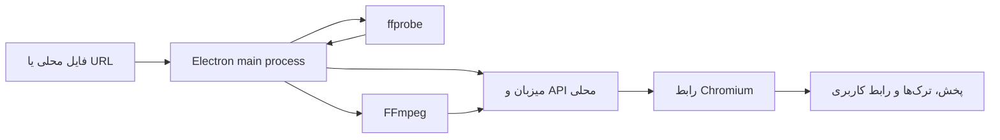

<div align="center">

# 🎬 Lumen Video Player

### پخش‌کنندهٔ رسانهٔ ویندوزی با رابط Liquid Glass، پشتیبانی گستردهٔ رسانه و موتور FFmpeg همراه


[فارسی](#فارسی) · [English](#english) · [دانلود سورس R9](./Lumen-source-r9.zip)

</div>

> **محتوای این مخزن:** سورس Revision 9 در فایل ZIP قرار دارد. این ZIP فقط پوشهٔ سورس را شامل می‌شود و **EXE، نصاب یا خروجی build ندارد**؛ برای ساخت برنامه باید مراحل پایین را روی Windows اجرا کنید.

---

<a id="فارسی"></a>

## 🇮🇷 دربارهٔ Lumen

**Lumen** یک پخش‌کنندهٔ رسانه برای Windows است که رابط آن با HTML/CSS/JavaScript و میزبان دسکتاپ آن با Electron ساخته شده است. رابط مدرن Liquid Glass با امکان کار با فایل‌های محلی، نشانی‌های آنلاین، فهرست پخش و ترک‌های زیرنویس ترکیب شده است.

در نسخهٔ ساخته‌شده، **FFmpeg و ffprobe همراه برنامه** قرار می‌گیرند. اگر Chromium نتواند کدک یک رسانه را مستقیم پخش کند، Lumen از موتور رسانه برای تبدیل سازگارتر به H.264/AAC استفاده می‌کند. برنامهٔ نصب‌شده برای دریافت FFmpeg به winget یا نصب جداگانهٔ codec pack متکی نیست و هنگام اجرا موتور را دانلود نمی‌کند.

## ✨ امکانات

- 🎞️ **پخش محلی و آنلاین:** بازکردن فایل یا پوشه، پخش URL/stream و برخی جریان‌های HLS؛ دریافت متن clipboard در دیالوگ Open URL.
- 🧩 **سازگاری کدک:** بررسی رسانه با ffprobe و استفاده از مسیر remux یا تبدیل هنگام نیاز. پشتیبانی دقیق به فایل، پروفایل، عمق رنگ، رمزگذاری و وضعیت خود stream بستگی دارد.
- 🗣️ **زیرنویس:** ترک‌های داخلی و فایل‌های کناری، بارگذاری دستی، تأخیر زیرنویس، و پشتیبانی از زیرنویس‌های آنلاین/stream.
- 🌐 **تطبیق مقاوم‌تر زیرنویس کناری در R8/R9:** نام‌های فارسی و Unicode، رقم‌های فارسی/عربی، نام فایل متفاوت، پوشهٔ شلوغِ دارای یک رسانه و زیرپوشه‌های متعارف `Subs` بررسی می‌شوند. تطبیق اپیزودِ ناسازگار و موارد مبهم در پوشه‌های چندرسانه‌ای رد می‌شوند.
- 🎨 **تنظیم ظاهر زیرنویس:** فونت، اندازه، رنگ، ضخامت، سایه، دورخط، پس‌زمینه و محل عمودی؛ **Reset look** برای بازگرداندن تنظیم‌ها باقی است. نمونهٔ Preview از Settings حذف شده است.
- 🪟 **حالت‌های نمایش:** تمام‌صفحه، Mini player، Picture in Picture و Always on top.
- 📚 **فهرست و کنترل پخش:** فهرست پخش، جست‌وجو، ادامهٔ پخش، سرعت، صدا، تِم‌ها و کنترل‌های لمسی.
- 🖱️ **تعامل دسکتاپ:** منوی راست‌کلیک، میان‌برها و دیالوگ Open URL با Cut/Copy/Paste.

### فرمت‌ها و محدودیت‌ها

موتور FFmpeg به طیف وسیعی از containerها و codecها دسترسی می‌دهد، از جمله MKV، MP4/MOV، WebM، AVI، MPEG-TS، FLV، WMV، Ogg و MXF؛ و HEVC/H.265، H.264، AV1، VP9/VP8، MPEG، VC-1 و ProRes. فرمت‌های رایج زیرنویس شامل SRT، VTT، ASS و SSA است.

> فهرست بالا تضمین پخش هر فایل نیست. فایل خراب، ناقص، رمزگذاری‌شده یا دارای پروفایل/عمق رنگ نامعمول ممکن است به تبدیل طولانی یا پخش‌نشدن منجر شود؛ تبدیل 4K یا 10-bit نیز می‌تواند CPU زیادی مصرف کند.

## 🏗️ معماری در یک نگاه



## ⬇️ دانلود و ساخت از سورس

1. فایل [**Lumen-source-r9.zip**](./Lumen-source-r9.zip) را از این مخزن دانلود و Extract کنید.
2. وارد پوشهٔ `source` شوید.
3. در Windows فایل `build-windows-r9.bat` را اجرا کنید.

**پیش‌نیازها:** Windows x64، Node.js **22.12 یا جدیدتر**، NSIS 3.x و اتصال اینترنت برای دریافت dependencyها و runtimeهای پین‌شده. BAT وجود NSIS را در PATH و مسیرهای استاندارد بررسی می‌کند.

خروجی در پوشهٔ `build\r9\windows` کنار پوشهٔ `source` قرار می‌گیرد و شامل نسخهٔ قابل‌حمل و نصاب per-user است. فایل‌های اجرایی در ZIP سورس قرار ندارند.

### خطای TLS در دانلود

اگر Windows Schannel خطای `CRYPT_E_REVOCATION_OFFLINE` بدهد، BAT دانلود را با `curl --ssl-no-revoke` دوباره امتحان می‌کند. این retry فقط بررسی وضعیت revocation را دور می‌زند؛ بررسی زنجیرهٔ گواهی و hostname برقرار می‌ماند و SHA-256 پین‌شدهٔ بایگانی پیش از استفاده کنترل می‌شود. این مسیر برای دانلود FFmpeg و Electron در زمان build است، نه هنگام اجرای برنامه.

## 🧪 آزمون‌ها

از ریشهٔ پوشهٔ `source`:

```bash
node tests/test-sidecar-matcher.js
node tests/test-source-ui.js
```

- آزمون تطبیق و استخراج زیرنویس: **۸/۸**.
- بررسی ساختاری Settings، ادغام ترک‌ها، NSIS و fallback مربوط به BAT: **۷/۷**.
- گزارش جزئی و محدودیت‌های محیط در `source/tests/results-r9-source.json` ثبت شده است. BAT و نصب نهایی باید روی Windows واقعی هم اجرا و تأیید شوند.

## 📦 وضعیت Revision 9

R9 شامل اصلاح تشخیص زیرنویس‌های کناری و حذف Preview از Settings است و خطای Schannel در دانلود build را نیز پوشش می‌دهد. شناسهٔ ساخت: `r9-2026-10-04`.

## ⚖️ مجوزها

`package.json` مجوز برنامه را MIT اعلام می‌کند. FFmpeg 9.0.2 essentials مورد استفاده در build از Gyan.dev می‌آید و تحت **GPLv3** معرفی شده است؛ مجوز FFmpeg جدا از مجوز کد برنامه است. یادداشت‌های مجوز و محدودیت بررسی source متناظر در `source/vendor/ffmpeg/win-x64/NOTICE-FA.txt` قرار دارند. پیش از توزیع عمومیِ build همراه FFmpeg، الزامات مجوز و منبع متناظر تمام وابستگی‌ها را بررسی کنید.

## 📬 تماس

**Behnam Ehsani** · [Inbox.ehsani@gmail.com](mailto:Inbox.ehsani@gmail.com)

---

<a id="english"></a>

## 🇬🇧 English

**Lumen** is a Windows media player built with Electron and a web-based Liquid Glass UI. The built Windows app bundles FFmpeg/ffprobe and can route media that Chromium cannot decode through a compatibility remux/transcode path. Actual playback depends on the file, codec profile, bit depth, encryption, and stream integrity.

### Highlights

- Local files and folders, URL/stream input, playlists, and selected HLS streams.
- Embedded, sidecar, and online subtitles; R8/R9 improve Unicode/Persian filename matching, cluttered single-media folders, and common `Subs` folders.
- Subtitle font, size, color, shadow, outline, background, position, and delay controls. The Settings sample Preview is removed; **Reset look** remains.
- Fullscreen, Mini player, Picture in Picture, Always on top, keyboard/context-menu controls, themes, and touch interactions.
- No runtime FFmpeg download. The source-build BAT fetches pinned build-time archives and verifies their SHA-256 values.

### Build

Download and extract [`Lumen-source-r9.zip`](./Lumen-source-r9.zip), enter `source/`, then run `build-windows-r9.bat` on Windows x64. Requirements: Node.js 22.12+, NSIS 3.x, and Internet access. Build output is created outside `source/` under `build/r9/windows`; this repository artifact itself contains source only, with no EXE or installer.

The BAT retries a Schannel download failure such as `CRYPT_E_REVOCATION_OFFLINE` with `curl --ssl-no-revoke`; certificate-chain/hostname validation and pinned SHA-256 checks remain in place. This is a build-time download fallback only.

### Tests and licensing

Run `node tests/test-sidecar-matcher.js` and `node tests/test-source-ui.js` from `source/`. The application license is declared MIT; the FFmpeg build is separately identified as GPLv3. Review the accompanying notices and corresponding-source obligations before redistribution.
